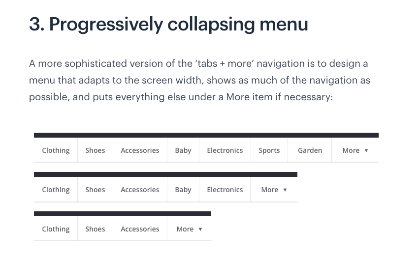

# Dynamic User Interfaces - Lesson

- from <https://www.theodinproject.com/lessons/node-path-javascript-dynamic-user-interface-interactions>

## Tasks

- Build a dropdown menu
  - You can allow the menu to show up either on click or on hover.
  - You should hard-code the menu items into your HTML but hide/reveal them using JavaScript. You can do this either by adding a class (visible or something) or by manually setting the style in JS.
  - Make sure the code is reusable! You should be able to create multiple drop-downs on a page without repeating the JavaScript code.
  - If you bundle your code into a module you can publish it to npm and then install and use it anytime you like! Nothing like publishing your modules to make you feel like a pro 😎.

- Mobile Menu
  - Look on the web, find one you like and implement it.

- Image slider (carousel)
  - Create a simple image carousel. It should contain arrows on each side to advance the image forward or backward. It should automatically move forward every 5 seconds. It should contain the little navigation circles at the bottom that indicate which slide you are on (and they should be clickable to advance to that particular slide).

## Planning - Dropdown Menu

- I think following an observer pattern might be a good pattern for a modular, reusuable menu drop-down. Maybe an interface pattern instead? I don't know yet.
- The menu that I like most is the menu that collapses dynamically into the `more` element as the screen size decreases. Probably also the hardest to implement. Sigh.  
  - Here is the example - Progressively collapsing menu from <https://marvelapp.com/blog/hamburger-menu-alternatives-mobile-navigation/>

    

- Going to build the modules and add them to my Webpack template repo for future use. I will have to research best practices on that. I know the lesson suggests that I publish the modules to npm, but I don't think I'm ready for that yet. I want more experience under my belt before throwing things out there that random people might use in their projects.  I am reminded of the incident when part of the internet broke when some package that did some crazy simple task in js was removed from npm by the creator.
